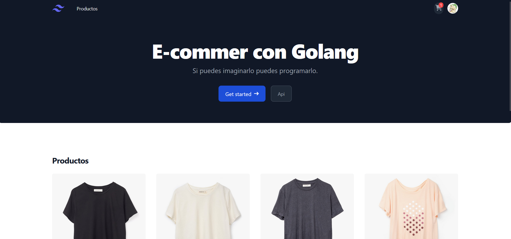
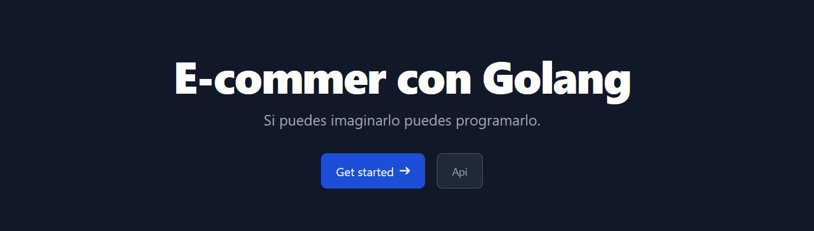
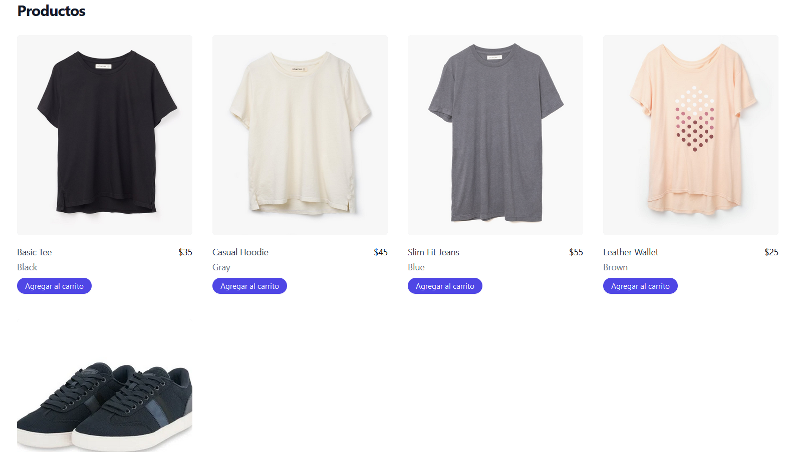

## Levantar Componentes de React
Dirección cd DemoWebEcommerceGo/project/client
 - npm install
- npm init
- npm run build
- npm run dev

## Levantar servidor
Es necesario cargar en la dirección "cd DemoWebEcommerceGo/project/server/run" un ."env" que se encargue de guardar las variables de logueo a la base de datos antes de ejecutar el comando 

Dirección : cd DemoWebEcommerceGo/project/server/run
- air
- go run server.go

## Componente (banner)

## Componente (productList.tsx)

## Componente (cartItems.tsx)

